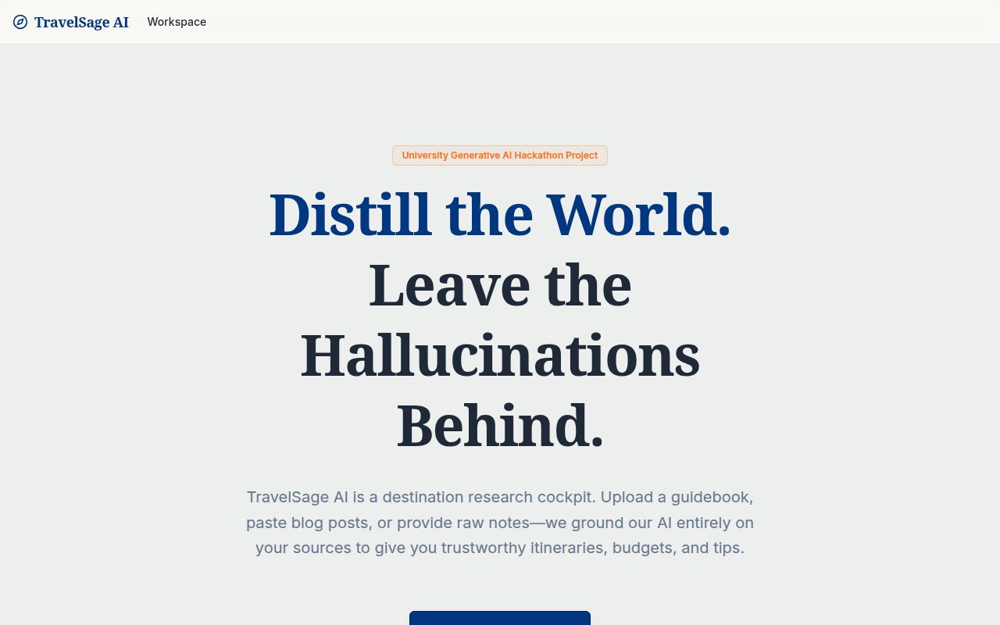
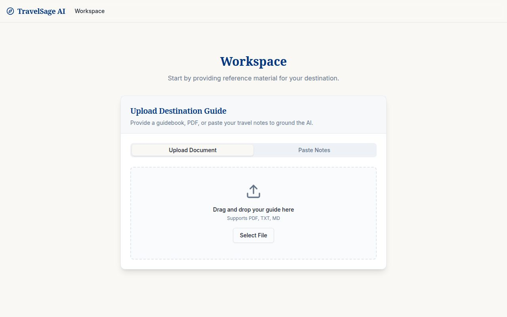

# TravelSage AI

A university Generative AI hackathon project: a destination research cockpit that grounds every AI answer in **your** uploaded travel material — so it never hallucinates.

Upload a guide (PDF / TXT / MD) or paste your own notes, and TravelSage AI will:
- Answer questions using only your sources
- Generate day-by-day itineraries
- Build packing lists
- Estimate budgets
- Summarize culture and safety tips
- Show a transparent AI log of every call

## Screenshots

### Landing page

### Workspace — upload your guide

## Tech Stack
- **Frontend:** React + Vite (TypeScript)
- **Backend:** Node.js + Fastify (TypeScript)
- **AI:** OpenAI `gpt-4o-mini` via Replit AI Integrations (no user API key required)
- **Retrieval:** In-memory document + vector store with deterministic local embeddings
- **Contracts:** OpenAPI → generated React Query client + Zod validators
- **PDF parsing:** `pdf-parse`

## Project Layout
- `artifacts/travelsage-ai/` — React web app
- `artifacts/api-server/` — Fastify API (upload, chat, itinerary, packing, budget, tips, logs)
- `lib/api-spec/openapi.yaml` — API contract
- `lib/api-client-react/` — generated typed client
- `GRANDMA.md` — plain-language explainer

## Guardrails
- Refuses to answer if the question isn't covered by the uploaded material
- Blocks prompt-injection patterns
- Normalizes AI output to keep the UI stable even if the model returns unexpected shapes

## Running Locally
Each artifact has its own dev workflow; they run automatically in Replit. The API binds to `PORT` and the web app is proxied at `/`.
